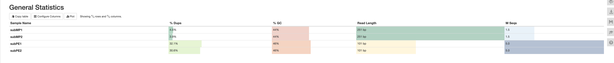
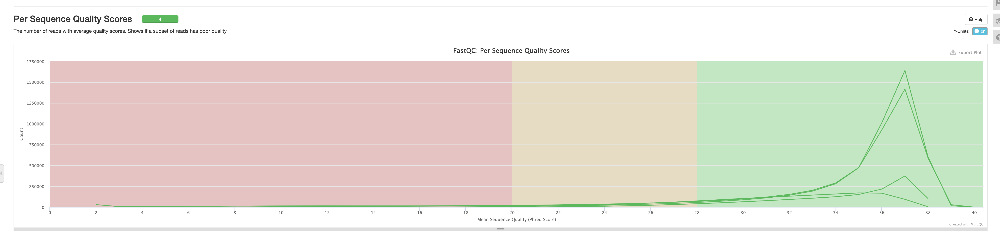
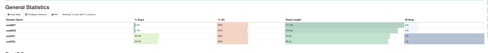
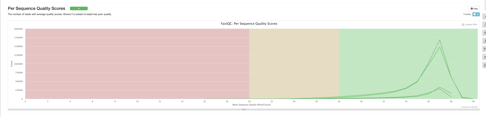
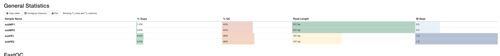
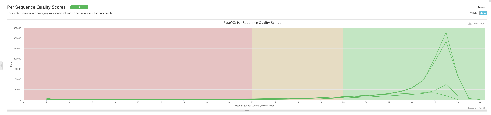
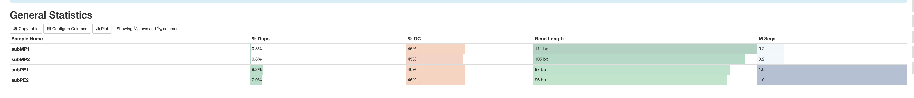
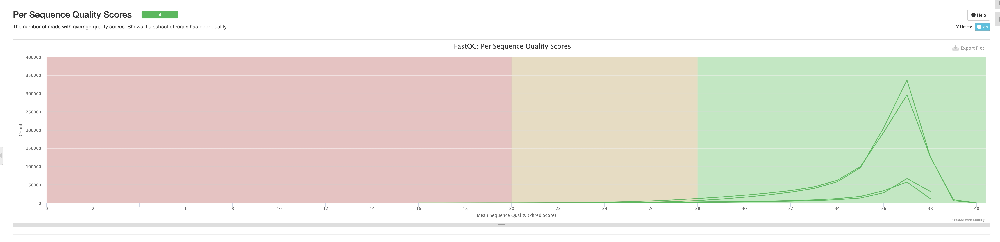

### Основная часть
```bash
./work.sh base
```

multiQC:


на подрезанных данных:



Анализ:
```
contigs: 
	count: 621
	length: 3924840
	max length: 179307
	N50: 47611
scaffolds: 
	count: 69
	length: 3875471
	max length: 3831086
	N50: 3831086
	gap count before trim: 1515
	gap length before trim: 6162
	gap count after trim: 620
	gap length after trim: 2505
``` 

### Бонус
```bash
export N=1000000
export M=300000
./work.sh bonus
```
multiQC:


на подрезанных данных:



Анализ:
```
contigs: 
	count: 1276
	length: 3913890
	max length: 187087
	N50: 64093
scaffolds: 
	count: 156
	length: 3853897
	max length: 1893198
	N50: 892403
	gap count before trim: 1391
	gap length before trim: 5655
	gap count after trim: 1001
	gap length after trim: 4030
``` 

### Вывод

При уменьшении кол-ва чтений качество генома упало: кол-во скаффолдов увелилось, N50 уменьшился, длинна максимального скаффолда уменьшилась и т.д.